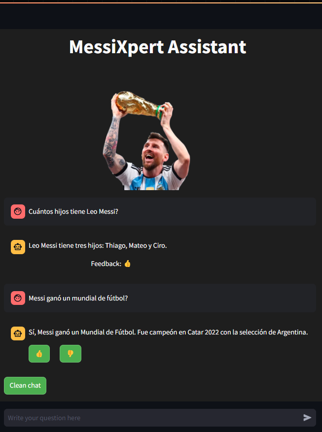
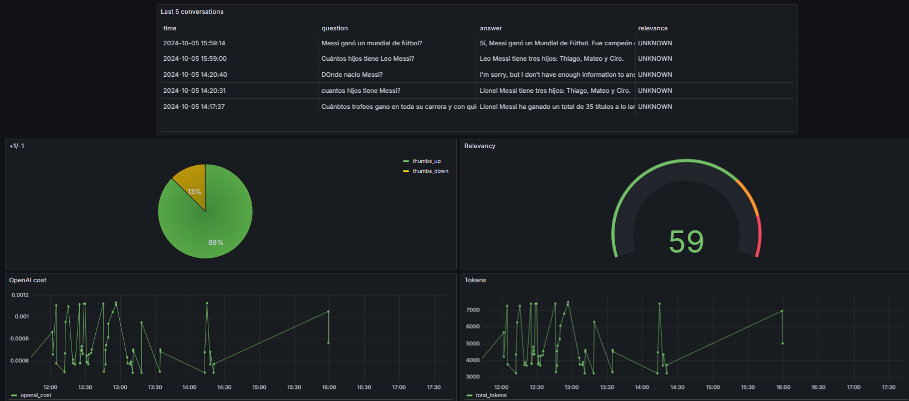
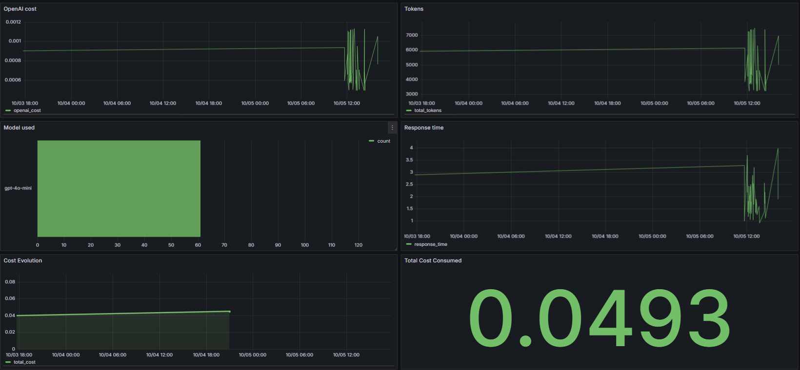

<h1 align="center">
    MessiXpert Assistant
</h1>

<p align="center">
  
</p>
<hr>
<br>

The **MessiXpert Assistant** is a Retrieval-Augmented Generation (RAG) application designed to provide users with detailed insights into Lionel Messi's career. From historical statistics to lesser-known trivia, the assistant can answer all sorts of Messi-related queries by combining a local knowledge base (generated from Lionel Messi's [wikipedia website](https://es.wikipedia.org/wiki/Lionel_Messi)) and large language models capabilities.

This project was implemented for
[LLM Zoomcamp](https://github.com/DataTalksClub/llm-zoomcamp) -
a course about LLMs and RAG.
<br>
<br>
<p align="center">
  
</p>

<br>
<br>

## Project overview

The MessiXpert Assistant is a cutting-edge Retrieval-Augmented Generation (RAG) application, designed to bring the magic of AI into the world of football knowledge.
Leveraging advanced AI models and Elasticsearch as a powerful vector database, the MessiXpert Assistant provides a dynamic, engaging platform that not only answers your questions about Lionel Messi's legendary career but also helps you dive deep into the statistics, stories, and moments that shaped football history.

Whether you're a football enthusiast, sports analyst, or just curious about Messi's journey, the MessiXpert Assistant offers an interactive and conversational experience that brings you closer to the game.
By combining high-performance search capabilities with a large language model, it provides nuanced and detailed responses, drawing from a vast repository of curated knowledge.
You can ask about Messi's greatest achievements, his rivals, and detailed stats about his games — all through a sleek, user-friendly chat interface.

The application is built with the goal of making complex football data accessible and fun.

<br>
<br>

## Dataset
The dataset used in this project is derived from the [wikipedia website](https://es.wikipedia.org/wiki/Lionel_Messi) of Lionel Messi. It contains detailed information about his career, achievements, and personal life, meticulously chunked and structured for use in retrieval-augmented generation (RAG). 
The dataset includes:

- **Content**: Detailed textual data extracted from the Wikipedia page, covering different phases of Messi's career, his early life, major achievements, and notable moments.
- **Headers Concatenation**: The section headers from the original Wikipedia page that provide context for each chunk of data (e.g., "Career Beginnings", "International Success").
- **Chunk Size**: Each piece of content is divided into smaller chunks, with their respective sizes recorded.
- **Source URL**: The URL of the Wikipedia page for reference, which ensures transparency and verifiability.
- **Content Type**: The type of information within each chunk, such as paragraphs or tables.
- **Chunk Size**: The chunk size of each chunk in tokens.
- **Ingestion Date**: The timestamp indicating when the data was ingested into the knowledge base.

The dataset forms the foundation for MessiXpert's retrieval capabilities, allowing the system to generate relevant and insightful responses regarding Messi's life and career. It serves as the source for both the fact-checking features and the historical context provided to users.

You can find the scrapped raw data in [data/raw/wiki_Lionel_Messi.html](data/raw/wiki_Lionel_Messi.html).

<br>
<br>

## Technologies


- Python 3.12: Base programming language.
- [Docker](https://www.docker.com/) and Docker Compose: Utilized for containerizing the application, simplifying deployment, and managing dependencies.
- [Elasticsearch](https://www.elastic.co/es/): Serves as the vector database for storing and retrieving embedded text data from Messi's Wikipedia page.
- [Streamlit](https://streamlit.io/): Provides an interactive UI for users to ask questions about Messi's life and career.
- [Grafana](https://grafana.com/): Used for monitoring the application's performance, capturing metrics, and visualizing feedback data.
- [PostgreSQL](https://www.postgresql.org/): Backend database for storing conversation data, feedback, and application monitoring logs.
- [OpenAI](openai.com): Used as the LLM to provide natural language answers to user queries, evaluating, testing, and other techniques that will be mentioned.
- [Ollama](https://ollama.com/) (Phi-3 Model): Used as an open-source LLM to evaluate answers.
- [BeautifulSoup](https://beautiful-soup-4.readthedocs.io/en/latest/): For scrapping the Lionel Messi's wikipedia website.

<br>
<br>

## Preparation

Since the MessiXpert Assistant uses Ollama with the Phi-3 model and integrates various components like Elasticsearch and PostgreSQL, you'll need to set up a few things:

- **Install Docker and Docker Compose:** If not already installed, you can install Docker following the official guide: [Install Docker](https://docs.docker.com/engine/install/). Docker Compose is typically included with Docker Desktop.

- **Environment Variables:** Create a .env file in the root of the project. You can use the provided .env_template as a starting point.
Update the .env file with the necessary variables, such as database credentials (POSTGRES_USER, POSTGRES_PASSWORD, etc.) and any required API keys.

- **Run Docker Compose:** The application is containerized using Docker. To set up the required services (Elasticsearch, PostgreSQL, Grafana, etc.), run:

```bash
docker-compose up
```

This command will pull and start all necessary containers.

- **Initialize the PostgreSQL Database:**  Before starting the application, initialize the database to create the required tables for conversation and feedback logs.
Use the provided script [scripts/set_up_db.py](scripts/set_up_db.py) to initialize the database:

```bash
docker exec -it messixpert-rag-postgres-1 python set_up_db.py
```

Ensure PostgreSQL is running before executing the above command.

To check the content of the database, you can connect to the PostgreSQL instance using psql. First, execute the following command to access the container:

```bash
docker exec -it messixpert-rag-postgres-1 psql -U admin -d messiXpert_assistant
```

You can then view the schema using the \d command:

```sql
\d answers;
```

And to select from the table:

```sql
select * from answers;
```

- **Dependencies:** The main application dependencies are listed in the requirements.txt file. You can install them by running:

```bash
pip install -r requirements.txt
```

With these steps, the environment should be properly set up to run the MessiXpert Assistant.

<br>
<br>

## Using the application

Once the application is running, you can start interacting with MessiXpert Assistant through the Streamlit interface.

**Web Application (Streamlit)**
The application is built using Streamlit, which provides an interactive web interface to ask questions related to Lionel Messi's data.

First, be ensured that the application is running or start it running:

```bash
docker-compose up
```

This will spin up all the required services, including the application.

Once the services are running, navigate to (`http://localhost:8501`)[http://localhost:8501] in your browser. You will see the MessiXpert Assistant interface where you can start asking questions after adding your OpenAI API Key.

Simply type your question in the input box, and MessiXpert Assistant will provide an answer based on the data available about Lionel Messi.

<br>
<br>

## Code Structure

The code for the MessiXpert Assistant is organized into several folders, each serving a specific purpose:

### Folder Structure

- **[assets/](assets/):** Contains the visual assets used in the project, such as images for the Streamlit interface and banners.

- **[data/](data/):** Holds the dataset used in the application, sepparated in two folders, the [raw](data/raw/) and the [processed](data/processed/).
As the final version uses the wikipedia webapge, we'll just have the files in the raw folder which includes the extracted information about Lionel Messi from Wikipedia in the form of HTML ([wiki_Lionel_Messi.html](/data/raw/wiki_Lionel_Messi.html)).
This dataset is used to populate the vector search index for retrieval.

- **[monitoring/](monitoring/):** Contains the configuration files for Grafana, including the dashboard JSON files. This helps in setting up monitoring to visualize application metrics such as response time, token usage, and cost.

- **[notebooks/](notebooks/):** Includes Jupyter notebooks that were used for experimentation during the development of the RAG pipeline. These notebooks can be used to test retrieval models and evaluate the performance of different configurations. There are all the techinques tried that were learnt all along the course, and that were learnt from other resources.
    
    - [01-ingestion](notebooks/01-ingestion.ipynb): The ingestion steps for scrapping the wikipedia website and extracting the .html, parsing the information, chunking, processing, and storing in the ElasticSearch Database.
    - [02-rag](notebooks/02-rag.ipynb): The RAG steps required for querying the knlowedge base and using an LLM to generate the answer, and to judge the answer as relevant or not with an "LLM AS A JUDGE" technique.
    - [aux-01-ground_truth_generation](notebooks/aux-01-ground_truth_generation.ipynb): The notebook used for generating the ground truth with five questions about each chunk of the knowledge base. The results are saved as .csv's files. I've used gpt-4o-mini model.
    - [aux-02-evaluating](notebooks/aux-03-evaluating.ipynb): The notebook used for evaluating the RAG, retrieval, and answers. There were used several techniques for evaluating:
        - For **Retrieval**: Text, Vector (KNN) and Hybrid search. Metrics used were MRR and Hit Rate. When needed, a RRF document re-ranking technique were applied.
        - For **RAG**: LLM's As A Judge, Multiple Prompts and Query rewritting techniques were applied.
        - For **querying**: Multiple prompts tried and query rewritting with an llm.
    - [main](notebooks/main.ipynb): The complete notebook that integrates the mentioned previously.

- **[scripts/](scripts/):** Contains all the utility scripts such as database initialization scripts, ingestion scripts, and other supporting tools needed for the project setup.

    - [db.py](scripts/db.py): Contains functions for connecting to the PostgreSQL database and saving user conversations and feedback.
    - [ingestion.py](scripts/ingestion.py): Script for automating the ingestion pipeline generated from the notebook mentioned before.
    - [init_grafana.py](init_grafana.py): A script for setting up Grafana datasources and dashboards programmatically.
    - [rag.py](scripts/rag.py): Script for automating the rag steps of pipeline generated from the notebook mentioned before.
    - [set_up_db.py](scripts/set_up_db.py): Script for automating the db set up tasks.

- **[tests/](tests/):** Holds the csv of the tests done, ground truth and ground truth evaluations. Open-source and licensed models were used. Different chunking strategies were also tried.

- **[ui/](ui/):** Contains the main interface files for the Streamlit application. For instance:

    - [app.py](ui/app.py): The primary entry point for running the Streamlit web application, which includes the user interface and logic for interacting with the user.


### Core Files

In addition to the organized folders, some core files can be found in the root of the project:

- [.env_template](.env_template): Template for the .env file to generate. For instance just the OpenAI API Key needs to be replaced.

- [docker-compose.yml](docker-compose.yml): The docker compose file for installing and configuring the required docker images.

- [Dockerfile](Dockerfile): The Dockerfile for the app.

- [requirements.txt](requirements.txt): The requirements needed for running the application.


With this structure, each folder and file plays a specific role in the development and functionality of the MessiXpert Assistant, ensuring modularity and maintainability.

<br>
<br>

## Experiments

For experiments, different Jupyter notebooks were used as mentioned before.
They are in the [`notebooks`](notebooks/) folder.


### Retrieval evaluation

- The **Text Search retrieving** gave the following metrics:
    
    - Hit rate: 9%
    - MRR: 2%


- The **KNN Search retrieving** gave the following metrics:

- Hit rate: 10%
- MRR: 3%


- The **Hybrid Search retrieving** gave the following metrics:

- Hit rate: 17%
- MRR: 4%

- The **Hybrid Search retrieving with re-ranking** gave the following metrics:

- Hit rate: 17%
- MRR: 3%


> 📌 **NOTE:** The low metrics of hit_rate and mrr are related to the knowledge source. It's not a problem to have such metrics.
> 
> Wikipedia has different sections of information and the answer of a question can be found in different sections, and also in different chunks of each section information.
>
> The most relevant evaluation will be the RAG evaluation, possibly with an LLM As a Judge method.


### RAG flow evaluation

I've used the LLM-as-a-Judge metric to evaluate the quality
of our RAG flow.

For `gpt-4o-mini`, in a sample with 200 records, we had:

- 167 (98.5%) `RELEVANT`
- 3 (1.5%) `NON_RELEVANT`

I've also tested `phi3`:

- 168 (97%) `RELEVANT`
- 2 (3%) `NON_RELEVANT`


> The best results were achieved with an hybrid search and with gpt-4o-mini.

<br>
<br>

## Monitoring

Grafana were used to monitor the application, leveraging PostgreSQL as the backend database for storing monitoring data.

It's accessible at [localhost:3000](http://localhost:3000):

- Login: "admin"
- Password: "admin"

<br>

### Dashboard

<br>
<br>
<p align="center">
  
</p>
<br>
<br>
<br>
<p align="center">
  
</p>
<br>
<br>

The monitoring dashboard contains several panels to track key metrics:

1. **Last 5 Conversations (Table):** Displays a table showing the five most recent conversations, including details such as the question, answer, relevance, and timestamp. This panel helps monitor recent interactions with users.
2. **+1/-1 (Pie Chart):** A pie chart that visualizes the feedback from users, showing the count of positive (thumbs up) and negative (thumbs down) feedback received. This panel helps track user satisfaction.
3. **Relevancy (Gauge):** A gauge chart representing the relevance of the responses provided during conversations. The chart categorizes relevance and indicates thresholds using different colors to highlight varying levels of response quality.
4. **OpenAI Cost (Time Series):** A time series line chart depicting the cost associated with OpenAI usage over time. This panel helps monitor and analyze the expenditure linked to the AI model's usage.
5. **Tokens (Time Series):** Another time series chart that tracks the number of tokens used in conversations over time. This helps to understand the usage patterns and the volume of data processed.
6. **Model Used (Bar Chart):** A bar chart displaying the count of conversations based on the different models used. This panel provides insights into which AI models are most frequently used.
7. **Response Time (Time Series):** A time series chart showing the response time of conversations over time. This panel is useful for identifying performance issues and ensuring the system's responsiveness.
8. **Cost Evolution (Time Series):** A time series line chart depicting the hystorical cost evolution associated with OpenAI usage over time.
9. **Total Cost Consumed (KPI):** A KPI with the total cost of the consumption of OpenAI LLM Models.

<br>

### Setting up Grafana

To configure Grafana with the MessiXpert Assistant project, follow these steps:

Grafana configurations is in the [scripts/init_grafana.py](scripts/init_grafana.py) file.

Grafana Dashboard is in the [`dashboard.json`](grafana/dashboard.json) file.

To initialize the dashboard, first ensure Grafana is
running (it starts automatically when you do `docker-compose up`).

Then run:

```bash
python init_grafana.py
```

Then go to [localhost:3000](http://localhost:3000):

- Login: "admin"
- Password: "admin"

When prompted, keep "admin" as the new password.

This setup will ensure that you have monitoring enabled for the MessiXpert Assistant project, allowing you to track and visualize key metrics for your RAG system.

<br>
<br>

## Acknowledgements

Thanks to the DataTalksClub community and the LLM Zoomcamp organizers for providing the inspiration and support to work on this project.
